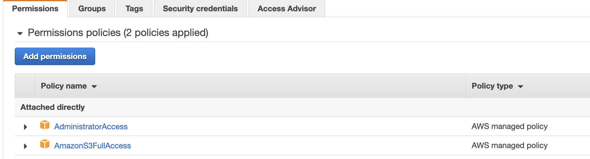

# Simulator to generate training set

This simple Python code can be used to generate random data of companies within industries with revenue and number of employees and generate churn or not label.

## Run the simulator

```sh
# Start the docker enviroment for python 3.9 or 3.10 from the Dockerfile in 
docker run --rm  --name pythonapp -v $(pwd):/app -v ~/.aws:/root/.aws -it  -p 5000:5000 jbcodeforce/aws-python bash
# In the shell go to /app and do
python CompanyDataGenerator.py companies.csv --nb_records 100000
```

## Code explanations

* Use argparser to define the argument for the command line
* Generate nb_records row: company has unique id, industry is selected randomly, revenue and number of employee is linked to the revenue.
* Churn flag is set to 1 if revenue is low
* Use `csv` library to write the csv file

### Run the program

1. Be sure to have last aws CLI and python library using the docker image if not rebuild the image from [aws-studies labs folder](https://github.com/jbcodeforce/aws-studies/tree/main/labs)

    ```sh
    docker build -f https://raw.githubusercontent.com/jbcodeforce/aws-studies/main/labs/Dockerfile -t jbcodeforce/aws-python .
    ```

1. Start the python env with docker

    ```sh
    docker run --rm  --name pythonapp -v $(pwd):/app -v ~/.aws:/root/.aws -it  -p 5000:5000 jbcodeforce/aws-python bash
    ```

1. Run the data generator

    ```sh
    python CompanyDataGenerator.py companies.csv --nb_records 100000
    ```

## Upload generated file to S3

### Pre-requisites

1. Be sure to have an IAM role with S3FullAccess

    

1. Get Access Key and Secret key and configuge aws, we specific profile: `aws configure --profile s3admin`

1. Verify you can access s3 using: `aws s3 ls`
1. Be sure to have last aws CLI and python library using the docker image if not rebuild the image from [aws-studies labs folder](https://github.com/jbcodeforce/aws-studies/tree/main/labs)

    ```sh
    docker build -f https://raw.githubusercontent.com/jbcodeforce/aws-studies/main/labs/Dockerfile -t jbcodeforce/aws-python .
    ```

### Execute

1. Start the Python 3 environment using docker

    ```sh
    docker run --rm  --name pythonapp -v $(pwd):/app -v ~/.aws:/root/.aws -it  -p 5000:5000 jbcodeforce/aws-python bash
    ```

1. Using the python code and boto3 library do the following:

    ```sh
    python copyToS3.py us-west-2 jb-data-set $PWD/companies.csv 
    ```

If some libraries are not installed do `pip install -r requirements.txt`


## Develop a Random Forest model using SageMaker

