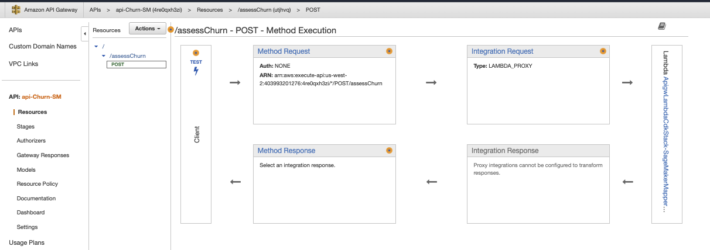
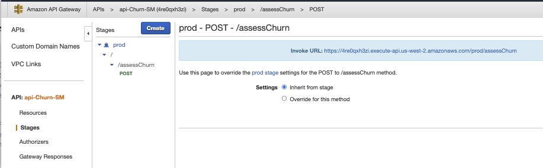

# Anti-corruption layer with Lambda function

As illustrated by the architecture diagram, SageMaker is not directly accessed from the real-time analytics component but via an API Gateway and a lambda function:


 The approach is to implement an anti-corruption layer where the data model of SageMaker is not corrupting the Tenant domain. This is a classical pattern in Domain Driven Design, and it makes sense in the context of this demonstration to illustrate this approach.

## Lambda

The goal of the lambda function is to call a scoring model deployed in SageMaker runtime, and do data transformation from Company business entity represented as JSON document and the csv payload expected by the SageMaker service.

The code is defined in [lambda-handler.py](https://github.com/jbcodeforce/big-data-tenant-analytics/blob/main/setup/saas-solution-cdk/lambda/lambda-handler.py).

The deployment can be fully automated with CDK.

For this lambda, to be able to access SageMaker, we need to define a IAM Role with SageMaker invokeEndpoint permission, 

```json
{
    "Version": "2012-10-17",
    "Statement": [
        {
            "Action": [
                "sagemaker:InvokeEndpoint"
            ],
            "Resource": "*",
            "Effect": "Allow"
        }
    ]
}
```

and to get the function being able to generate logs (`AWSLambdaBasicExecutionRole`).

```json
{
    "Version": "2012-10-17",
    "Statement": [
        {
            "Action": [
                "logs:CreateLogGroup",
                "logs:CreateLogStream",
                "logs:PutLogEvents"
            ],
            "Resource": [
                "arn:aws:logs:us-west-2:403993201276:log-group:/aws/lambda/mapper-SMInvokeEndpoint:*"
            ],
            "Effect": "Allow"
        }
    ]
}
```

The Handler code is in the python program: [lambda-handler.py](https://github.com/jbcodeforce/big-data-tenant-analytics/blob/main/setup/saas-solution-cdk/lambda/lambda-handler.py)

## API Gateway

It is a fully managed service to define, deploy, monitor APIs: HTTP, REST, WebSocket. It forms the app-facing part of AWS Serverless. It supports hundred of thousands of concurrent API calls.

We are defining the API via CDK, see the [apigw_lambda_cdk.py](https://github.com/jbcodeforce/big-data-tenant-analytics/tree/main/setup/saas-solution-cdk/apigw_lambda_cdk/apigw_lambda_cdk.py)

Here is an example of the API defined in API Gateway to proxy SageMaker.



We can test the API and SageMaker using the following payload:

```json
{ 
    "companyID":"comp_4",
    "revenu": 99420,
    "industry": "travel",
    "employee": 4635,
    "job30": 10,
    "job90": 100,
    "monthlyFee": 400,
    "totalFee": 1200,
    "riskOfChurn":false
}
```

The result may look like:

```json
{ "churn": true}
```

To get the API URL endpoint, go to API Gateway, Stages environment and select the URL path:



this URL needs to be specified in the Kinesis Data Analytics parameters.