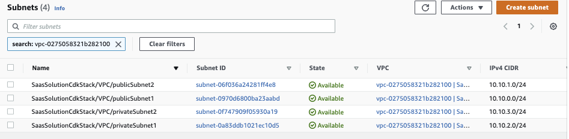
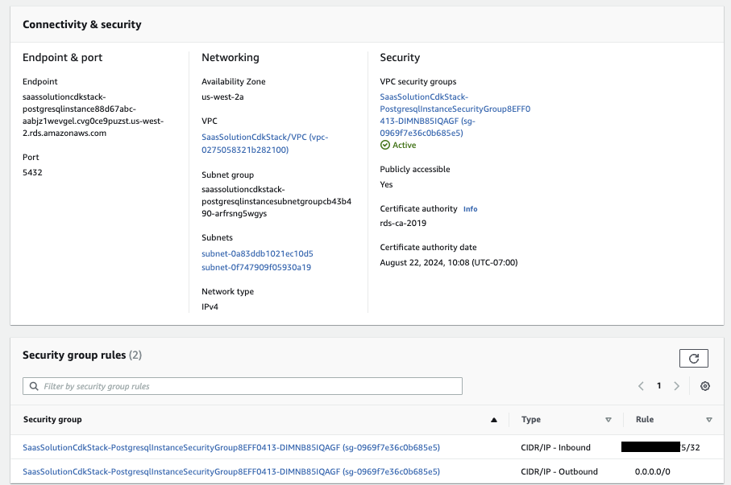

# Infrastructure as Code

To use an infrastructure as code, we use CDK to create all the needed services and resources. The AWS CDK revolves around a fundamental building block called a construct. These constructs have three abstraction levels:

* L1 – A one-to-one mapping to AWS CloudFormation
* L2 – An intent-based API
* L3 – A high-level pattern

The solution CDK is under `setup/saas-solution-cdk` folder. The CDK creates the following elements:

* [x] VPC with private and public subnets
* [x] RDS Postgresql
* [ ] EKS cluster
* [x] API Gateway
* [x] Lambda function
* [x] Kinesis Data Streams
* [ ] Kinesis Data Analytics

## Deploy

Under `setup/saas-solution-cdk`, start a python environment with AWS and CDK CLIs:

```sh
./startPythonDocker.sh
```

In the shell use:

```sh
cdk synth
# The first time you run CDK in your account in the selected region do: 
cdk bootstrap
cdk deploy
```

* Clean up

```
cdk destroy
```

## Explanations

### VPC

The declaration builds a VPC with 2 public and 2 private subnets:

```python
vpc = aws_ec2.Vpc(self, "VPC",
        max_azs=2,
        ip_addresses=aws_ec2.IpAddresses.cidr(cidr),
        nat_gateways=2,
        enable_dns_hostnames=True,
        enable_dns_support=True,
        subnet_configuration=[
            aws_ec2.SubnetConfiguration(
                name="public",
                subnet_type=aws_ec2.SubnetType.PUBLIC,
                cidr_mask=24),
            aws_ec2.SubnetConfiguration(
                subnet_type=aws_ec2.SubnetType.PRIVATE_WITH_EGRESS,
                name="private",
                cidr_mask=24) # could be /16 to have more instances, but this is a demo scope.
        ]
        )
```

The result:

{ width=1100 }

There are also two NAT gateways for outbound traffic and one Internet Gateway attached to the VPC.

Five route tables are created, one for each subnet: for public subnets each route defines all internet inbound traffic to go to Internet Gateway, local on CICD defines (10.10.0.0/16), use local network, and outbound traffic from private subnets goes to NAT gateways. 

### RDS CDK

Once the VPC is created, we want the database to be in private network, but accessible in public so we can use pgadmin to see the schema. This is for development purpose.

The declaration looks like:

```python
postgres = aws_rds.DatabaseInstance(self, "PostgresqlInstance",
                                database_name="tenantdb",
                                engine=aws_rds.DatabaseInstanceEngine.postgres(version=aws_rds.PostgresEngineVersion.VER_14_5),
                                vpc_subnets=aws_ec2.SubnetSelection(subnet_type=aws_ec2.SubnetType.PRIVATE_WITH_EGRESS),
                                vpc=self.vpc,
                                port=5432,
                                removal_policy=RemovalPolicy.DESTROY,
                                deletion_protection=False,
                                max_allocated_storage=200,
                                publicly_accessible=True
                        )
```

The cloudformation will create a secret in AWS Secret Manager with the credential, hostname... to access postgres database.

And the security group needs to be modified to add inbound rules for port 5432 from any IP v4 addresses.

{ width=1000 }

[RDS Connection setup documentation](https://docs.aws.amazon.com/AmazonRDS/latest/UserGuide/CHAP_GettingStarted.CreatingConnecting.PostgreSQL.html)

### EKS cluster

The declaration to create the EKS cluster in the same VPC is:

```python
cluster = aws_eks.Cluster(self, 'demo-cluster',
                    masters_role=self.eks_admin_role,
                    vpc=self.vpc,
                    default_capacity=2,
                    vpc_subnets=[aws_ec2.SubnetSelection(subnet_type=aws_ec2.SubnetType.PRIVATE_WITH_EGRESS)],
                    version=aws_eks.KubernetesVersion.V1_24,
                    output_cluster_name=True
                    )
```


## Deeper dive

* [See python CDK API ](https://docs.aws.amazon.com/cdk/api/v2/python/index.html)


