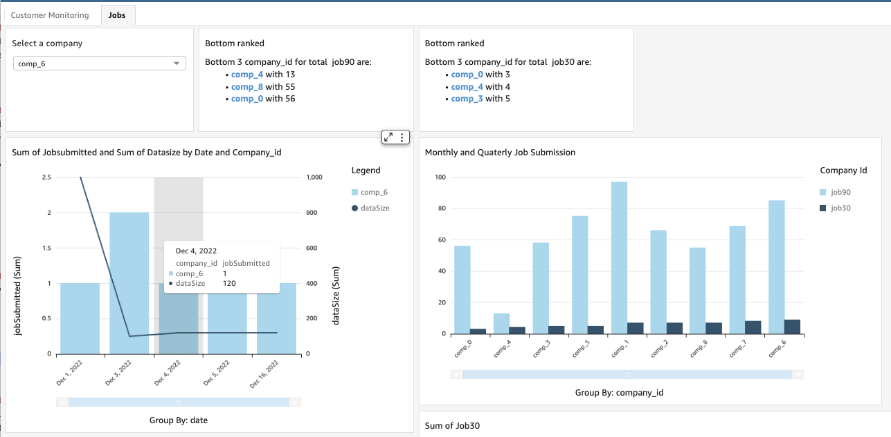

# Business DashBoard with QuickSight

## Business Insight Queries

Recall that the goals for this dashboard is to be able to answer to following questions:

* How often tenants work on data lake and then submit jobs?
* Which customers are not doing a lot of activities after logging?
* What is the size of their data set?
* How many batches are run per customer, per day?

## Why AWS QuickSight

Amazon QuickSight is a very efficient platform to integrate with the different AWS services to get data from, build dashboard with a lot of predefined visualization constructs. It integrates with RDS, Aurora, Athena, S3, RedShift, OpenSearch, Timestream, with Saleforce, Jira... and with any JDBC compliant database. It can import CSV, XLSX, JSON, TSV files and log files. Data can be cached in memory with the SPICE engine, to reduce the latency to data access.
Dashboards can be embedded inside any web app. 

Multiple users can collaborate on the development of dashboards, data sets can be shared between project. 

Finally it supports, end user to engage with conversational questions about the data by using the Amazon QuickSight Q ML-powered engine to receive relevant visualizations.

## End Result

The following first sheet of the dashboard includes visualization about all the AnyCompany's customers, with data per industry and then monthly revenue or total revenue per customer:

While the second sheet presents the job related number per day with some insight about the companies running the less jobs:

[Dashboard Link](https://us-west-2.quicksight.aws.amazon.com/sn/dashboards/1f7b933a-294e-4583-9ca4-a9fbabf5956a/sheets/1f7b933a-294e-4583-9ca4-a9fbabf5956a_aed7d0fd-c324-4f3b-87d9-97c8fa15a69c)

## Demonstration

* Go to the portal
* Explain each widgets
* Explain navigation: we can drill down from industry to company.

## Architecture

Business functions are illustrated in the figure below, with the SaaS big-data platform used by the SaaS customer's Data Sciences to run big data processing.

The job metadata and user's click streams are ingected to the SaaS data lake on which intelligent queries serve a BI dashboard.

If we take this business architecture and maps it with to AWS services we have the following figure:

(See detail in [the design section](../design/#quicksight-integration-design))

## Build the dashboard

* Start QuickSight
* Modify policy so QuickSight can access the bucket where Stream Analytics output its job's outcome.
* Define a manifest file for accessing the S3 bucket and folders (See [these manifests](https://github.com/jbcodeforce/big-data-tenant-analytics/tree/main/qs-dashboard) as source).

    * The files need to have the same structure
    If the upload of the manifest fails with a criptic message, [see this note](https://docs.aws.amazon.com/quicksight/latest/user/troubleshoot-connect-S3.html)

* Create a Dataset from S3 bucket customer file and one Dataset for jobs file
* Change the Type of Date from String to Date
* Add one Analysis and be sure to add the second dataset.
* Add visualization

