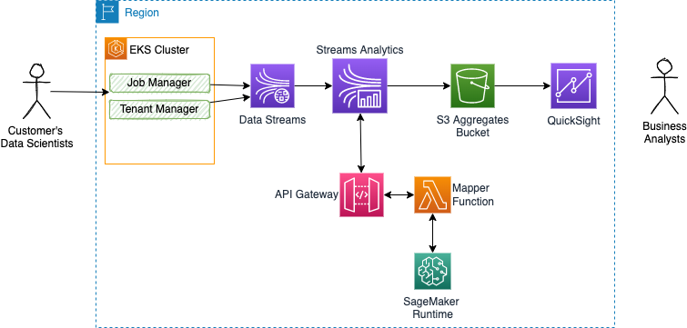

# Architecture and Design

This section addresses major architecture decisions and design choices:

## Component view

As presented in the introduction we have the following components in scope for this demonstration:


**Figure 1: Solution Component View**

* [The Dashboard](./#quicksight-integration-design) to present business insight on the execusion of the SaaS business.
* [SageMaker to support development of scoring model and runtime exposure](../model).
* [API Gateway and Lambda](#api-gateway-and-lambda-function-for-sagemaker) to proxy the predictive service.
* [Real-time data analytics](#kinesis-data-analytics)

## Domain Driven Design

### Event Definition

We need to track the following events:

* tenant created: company name and industry, sentiment about the company
* user added, user deleted
* user login, user logoff, user session timeoff
* jobSubmitted, jobTerminated, jobCancelled

* Data elements to consider: number of server, data size
* Concentrates those events into kinesis streams: companies, jobs
* Keep data for 24 hours
* Move data for long term persistence to S3, bucket per companies
* Use Sagemaker to develop a decision tree or random forest model to score risk of customer churn. The training set will be created by simulator so we can build a decision tree
* Deploy the model as sagemaker hosted service and integrate it into an agent that listening to events from jobs, users, tenant topics and score the risk of churn. Implement a Kinesis streams analytics with the logic of 


## EKS cluster creation and solution deployment

The microservices are deploy to EKS. We could have added Kafka as a middleware, deployed in EKS with the Strimzi operator, but the goal is to integrate with Kinesis Data Streams.

The following diagram illustrates the target deployment:


## [Kinesis Data Streams](https://aws.amazon.com/kinesis/data-analytics/)

### Why 

This is a managed service for pub/sub streaming data. It is a distributed data stream into Shards for parallel processing. Producer sends message with `Partition Key` and a throughput of 1 Mb/s or 1000 msg /s per Shard. A sequence number is added to the message to note where the message is in the Shard. 

* Retention from 1 to 365 days.
* Capable to replay the messages.
* Immutable records, not deleted by applications.
* Message in a shard, can share partition key, and keep ordering.
* Producer can use SDK, or Kinesis Producer Library (KPL) or being a Kinesis agent.
* Consumer may use SDK and Kinesis Client Library (KCL), or being one of the managed services like: Lambda, Kinesis Data Firehose, Kinesis Data Analytics.
* For consuming side, each Shard gets 2MB/s out.
* It uses enhanced fan-out if we have multiple consumers retrieving data from a stream in parallel. This throughput automatically scales with the number of shards in a stream.
* Pricing is per Shard provisioned per hour.
* The capacity limits of a Kinesis data stream are defined by the number of shards within the data stream. The limits can be exceeded by either data throughput or the number of reading data calls. Each shard allows for 1 MB/s incoming data and 2 MB/s outgoing data. You should increase the number of shards within your data stream to provide enough capacity.


### Deployment

The CDK app under `cdk/kinesis` folder defines the following components:


And the steps to start them are:

* Start the CDK app to create CloudFormation template and run it

```sh
cd cdk/kinesis
cdk deploy
```

* Verify the stream is created

```sh
aws kinesis list-streams
aws kinesis describe-stream-summary --stream-name bg-jobs
{
    "StreamDescriptionSummary": {
        "StreamName": "bg-jobs",
        "StreamARN": "arn:aws:kinesis:us-west-2:403993201276:stream/bg-jobs",
        "StreamStatus": "ACTIVE",
        "StreamModeDetails": {
            "StreamMode": "PROVISIONED"
        },
        "RetentionPeriodHours": 24,
        "StreamCreationTimestamp": "2022-12-20T21:11:04-08:00",
        "EnhancedMonitoring": [
            {
                "ShardLevelMetrics": []
            }
        ],
        "EncryptionType": "KMS",
        "KeyId": "alias/aws/kinesis",
        "OpenShardCount": 1,
        "ConsumerCount": 0
    }
}
```

* Put records

* Validate Records, even if data is encrypted by default:

```sh
SHARD_ITERATOR=$(aws kinesis get-shard-iterator --shard-id shardId-000000000000 --shard-iterator-type TRIM_HORIZON --stream-name bg-jobs --query 'ShardIterator')

aws kinesis get-records --shard-iterator $SHARD_ITERATOR
```

## [Kinesis Data Analytics](https://aws.amazon.com/kinesis/data-analytics/)

This is a managed service to transform and analyze streaming data in real time using Apache Flink, an open-source framework and engine for processing data streams. It can consume records from different source, and in this demonstration we use Kinesis Data Streams.


The underlying architecture consists of a **Job Manager** and n **Task Managers**. 

* The **JobManager** controls the execution of a single application. It receives an application for execution and builds a Task Execution Graph from the defined Job Graph. It manages job submission and the job lifecycle then allocates work to Task Managers.
* The **Resource Manager** manages Task Slots and leverages underlying orchestrator, like Kubernetes or Yarn.
* A **Task slot** is the unit of work executed on CPU.

* The **Task Managers** execute the actual stream processing logic. There are multiple task managers running in a cluster. The number of slots limits the number of tasks a TaskManager can execute. After it has been started, a TaskManager registers its slots to the ResourceManager

{ width=600px }

To support the execution of Flink job, KDA provides resources using units called Kinesis Processing Units (KPUs).

* One KPU represents the following system resources:
* One CPU core
* 4 GB of memory, of which one GB is native memory and three GB are heap memory
* 50 GB of disk space

The number of KPU = Parallelism parameter / ParallelismPerKPU parameter.

### When to choose what

As Apache Flink is an open-source project, it is possible to deploy it in a Kubernetes cluster, using Flink operator. This will bring you with the most flexible solution as you can select the underlying EC2 instances needed, to optimize your cost. Also you will have fine-grained control over cluster settings, debugging tools and monitoring.

While Kinesis Data Analytics helps you to focus on the application logic, which is not simple programming experience, as stateful processing is challenginf, there is no management of infrastructure, monitoring, auto scaling and high availability integrated in the service.

In addition to the AWS integrations, the Kinesis Data Analytics libraries include more than 10 Apache Flink connectors and the ability to build custom integrations. 

### Implementation Details

[See this dedicated note](../rt-analytics/)

## QuickSight Integration Design

We need to represent the following metrics within QuickSight:

* tenants, # of users
* job submitted over time per tenant
* last activity date per tenant
* number of job in last 30 and 90 days

The Dashboard is supported by Amazon QuickSight, which helps us to develop Analysis from different datasources, with drill down capabilities. The datasources are in S3 bucket with files that are continuously updated by the Data Streaming and Analtics components.  



In QuiskSight data sources are mapped to data sets, and we can apply data transformation for a better usage in analysis and visualisation. 

Here is an example of User Interface constructs:


For some implementation details [see this note](../dashboard/).

In the future we can automate the deployment of this dashboard by using CloudFormation. See [this note](https://devops.learnquicksight.online/quicksight-via-cloudformation.html).

## API Gateway And Lambda Function for SageMaker

As introduced in figure 1, API Gateway is deployed to expose REST API, and specially one supported by a Lambda function in backend to proxy SageMaker. The goal here is to add an anti-corruption layer into the domain of data streaming which most of the time represent business events while SageMaker use csv type of input.

There is a cloudFormation template defined in [setup/cloudformation folder](https://github.com/jbcodeforce/big-data-tenant-analytics/tree/main/setup/cloudformation) named `APIGW-Lambda.yaml` to declare API Gateway, role, and Lambda function. The following command create this stack in the connected Region:

```sh
aws cloudformation create-stack --stack-name apigw-lambda-sm --template-body file://APIGW-Lambda.yaml --parameters ParameterKey=sagemakerEndpoint,ParameterValue=linear-learner-2022-12-22-23-12-40-646 --capabilities CAPABILITY_NAMED_IAM
# Result looks like:
{
    "StackId": "arn:aws:cloudformation:us-west-2:......:stack/apigw-lambda-sm/5041dce0-.....8258-11ed-8ddc-06ec61b22a8d"
}
```


We can access the Lambda and perform a smoke test to verify we reach the SageMaker endpoint.


