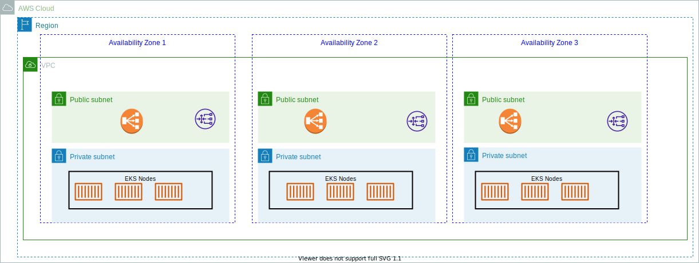

# Elastic Kubernetes Service

[Amazon EKS](https://aws.amazon.com/eks/) is a fully managed service to run Kubernetes. 



It is integrated with VPC for isolation, IAM for authentication, ELB for load distribution, and ECR for container image registry.

## Major characteristics

* Scale K8s control plane across multiple AZs.
* No need to install, operate and maintain k8s cluster.
* Automatically scales control plane instances based on load, detects and replaces unhealthy control plane instance.
* It supports EC2 to deploy worker nodes or Fargate to deploy serverless containers or [on to AWS Outposts](../../infra/#aws-outposts).
* Fully compatible with other CNSF kubernetes

## Create a cluster with CDK

To use an infrastructure as code, we use CDK to create a EKS cluster. The AWS CDK revolves around a fundamental building block called a construct. These constructs have three abstraction levels:

* L1 – A one-to-one mapping to AWS CloudFormation
* L2 – An intent-based API
* L3 – A high-level pattern

Under `setup/eks-cdk`, start a python environment with AWS and CDK CLIs:

```sh
./startPythonDocker.sh
```

In the shell use:

```sh
cdk synth
# may be do 
cdk bootstrap
cdk deploy
```

Outputs:
```sh
EksCdkStack.democlusterClusterName938388A9 = democlusterE73BD733-3cfbbaf2cea645f3bc9f8e1795f7c400
EksCdkStack.democlusterConfigCommandF40E856D = aws eks update-kubeconfig --name democlusterE73BD733-3cfbbaf2cea645f3bc9f8e1795f7c400 --region us-west-2 --role-arn arn:aws:iam::403993201276:role/eks-cluster-role
EksCdkStack.democlusterGetTokenCommand1B3872DA = aws eks get-token --cluster-name democlusterE73BD733-3cfbbaf2cea645f3bc9f8e1795f7c400 --region us-west-2 --role-arn arn:aws:iam::403993201276:role/eks-cluster-role
Stack ARN:
arn:aws:cloudformation:us-west-2:4....6:stack/EksCdkStack/391745e0-86e6-11ed-9ad9-0230bf738531

✨  Total time: 1501.45s
```

It should create a CloudFormation stack named EksCdkStack, and then VPC, public and private subnets, Internet Gateway, Routes, NAT gateway, IAM role resources.


[See python CDK API ](https://docs.aws.amazon.com/cdk/api/v2/python/index.html)


