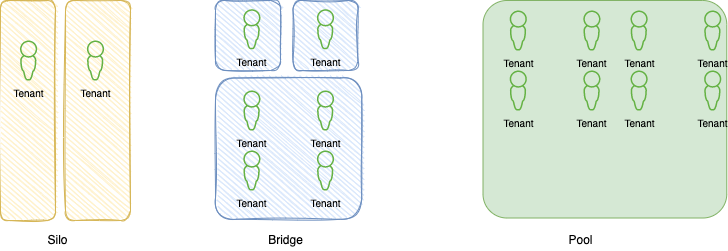
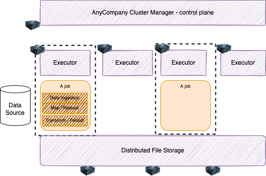
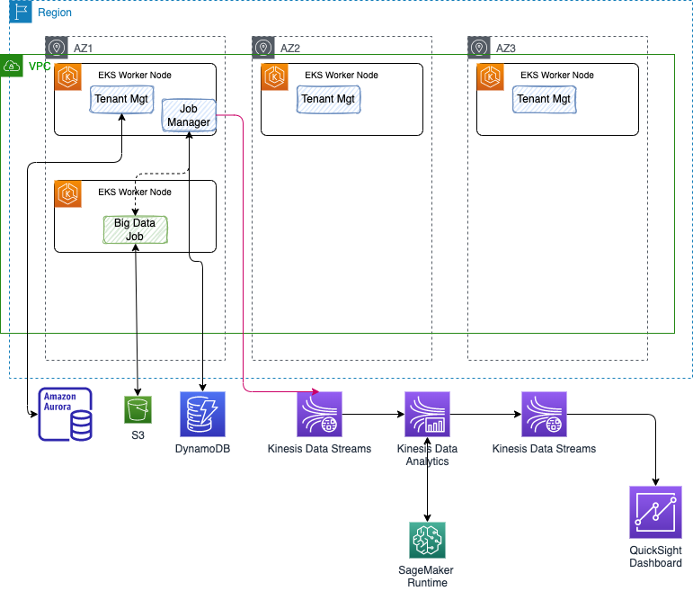

# Big Data SaaS management

As an ISV delivering Big Data platform for their on-premises customers, AnyCompany wants to move to a SaaS model. They designed a new architecture with multi-tenant support. They selected a bridge pattern to support their different customer's requirements:

**Figure 1: Multi-tenant patterns**

The bridge pattern means some customers will run their big data workload on a shared cluster, while others will be fully isolated at the cluster level. A fully isolated solution will be the Silo, where customers run on their own account and get a copy of the SaaS vendor software stack. 

The current software stack for the big data processing looks as in the figure below:

**Figure 2: Big-data simple view**

A control plane manages the job submission into a cluster of worker nodes. Each node has an executor that runs jobs. A job include data loading, transformation, processing and persistence of the results. Once jobs are terminated resources can be reallocated. The distributed file storage supports two use cases, the long term persistence, highly available and scalable of the data lake, and local NFS cluster to support job execution data caching or snapshots.

The new SaaS platform includes a set of microservices to register tenant, to manage account, billing, and specific components which support data catalog, and coordinate big data batch execution. 

The following diagram is the outcome of the Dicovery workshop hold early december 2022 with the AnyCompany architects to illustrates a high-level system context to support a MVP or a demonstration mapped to AWS services:

**Figure 3: Discovery outcome**

All the platform components are generating a lot of meta data about tenant, user's activities and job submission, and we want to propose to extend their SaaS architecture to leverage AWS services such as Kinesis, SageMaker, Quicksight to monitor their users activities and assess a risk of churn by not using the platform as expected. 

## Goals

The following business questions may be answered by using the new analytics platform:

* How often tenant register and user login, and work on data lake and then submit jobs?
* Which customers are not doing a lot of activities after logging?
* What is the size of their data set?
* How many batches are run per customer, per day?
* Can we identify the customers doing very minimum?

## Scope

From a demonstration point of view, we want to address the data pipeline, the Scoring service integration into real-time event processing, and dashboarding. The following figure illustrates the scope of the demonstration and then the content of this repository.

**Figure 4: Component View**

The control plane will be 2 Java Microprofile services that will persist state and generate events

* Tenant Manager is a basic Quarkus, JPA with Panache and Aurora Postgresql DB to persist Tenant -> Users tables.
* Job Manager to simulate creating Job to the Big Data platform.

Those two services run on AWS EKS the Kubernetes managed services. The value of running the microservices on EKS is to support a serverless deployment model, where Kubernetes cluster scale the K8s control plane across multiple AZs.

No need to install, operate and maintain k8s cluster. It automatically scales control plane instances based on load, detects and replaces unhealthy control plane instance. It supports EC2 to deploy worker nodes or Fargate to deploy serverless containers. EKS uses IAM to provide authentication to your Kubernetes cluster, and k8s RBAC for authorization. See [this note]() for details about running the SaaS solution control plane and customer data plane in a multi-tenant way to support the `bridge pattern`.

As en event-driven solution we want to have events ingected to Kinesis Data Streams so we can plug real-time analytics (running in Kinesis Data Analytics) to be able to answer some of the questions asked by the business users.

To prepare the scoring service with SageMaker we will add:

* A simulator to generate company churn data elements to build training data set
* A SageMaker notebook to do some feature engineering, build the model and deploy the model to SageMaker runtime so the service end point can be called asynchronously from the Kinesis Data Analytics component. For detail on those component read [this note](./model.md)

---

* account created: company name and industry, sentiment about the company
* user added, user deleted
* user login, user logoff, user session timeoff
* jobSubmitted, jobTerminated, jobCancelled

* Data elements to consider: number of server, data size
* Concentrates those events into kinesis streams: tenants, users, jobs
* Keep data for 7 days
* Move data for long term persistence to S3, bucket per tenant/user
* Use Sagemaker to develop a decision tree or random forest model to score risk of customer churn. The training set will be created by simulator so we can build a decision tree
* Deploy the model as sagemaker hosted service and integrate it into an agent that listening to events from jobs, users, tenant topics and score the risk of churn. Implement a Kinesis streams analytics with the logic of 
* Represent some metrics with QuickSight:
    * tenants, # of users
    * for a given tenant user activities over time
    * job submitted, cancelled, over time per tenant
    * last activity date per tenant
