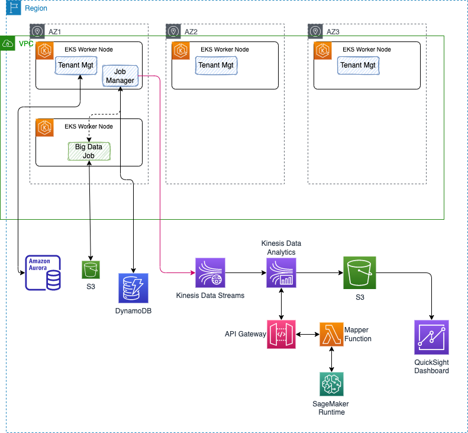

# Big Data SaaS Management Demonstration

!!! Update
    12/28/2022

## Introduction

As an ISV delivering Big Data platform for their on-premises customers, AnyCompany wants to move to a SaaS model. They designed a new architecture with multi-tenant support. They selected the multi-tebancy 'bridge' pattern to support their different customer's requirements:

**Figure 1: Multi-tenant patterns**

The **Bridge** pattern means some customers will run their big data workload on a shared cluster, while others will be fully isolated at the cluster level. A fully isolated solution will be with the **Silo** pattern, where customers run on their own account and get a copy of the SaaS vendor software stack. On the right side the **Pool** pattern is mostly used during product evalutio, tutorial, getting started with the SaaS product, where all the tenants are in the same cluster resource. Even in pool or bridge pattern the data are isolated.

The current AnyCompany's software stack for the big data processing looks as in the figure below:

**Figure 2: Big-data simple view**

A **control plane** manages the job submission into a cluster of worker nodes. Each node has an executor that runs jobs. A job includes a set of step for data loading, transformation, processing and persistence of the results. Once jobs are terminated resources can be reallocated. The distributed file storage supports two use cases, the long term persistence, highly available and scalable of the data lake, and local NFS cluster to support the job execution data caching and snapshots.

The new SaaS platform includes a set of microservices to register tenant, to manage account, billing, and specific components which support data catalog, and coordinate big data batch execution. 

The following diagram is the outcome of the Dicovery workshop hold early December 2022 with the AnyCompany architects to illustrates a high-level system context to support a MVP or a demonstration mapped to AWS services:

**Figure 3: Discovery outcome**

All the platform components are generating a lot of metadata about tenant, user's activities and job submissions, and we want to propose to extend their SaaS architecture to leverage AWS services such as Kinesis, SageMaker, Quicksight to monitor their users activities and assess the risk of churn bof leaving platform. 

## Business Motivations

The following business questions may be answered by using the new analytics platform:

* How often tenant register and user login, and work on data lake and then submit jobs?
* Which customers are not doing a lot of activities after logging?
* What is the size of their data set?
* How many batches are run per customer, per day?
* Can we identify the customers doing very minimum?

## Demonstration Scope

From a demonstration point of view, we want to address the data pipeline, the Scoring service integration into real-time event processing, and the dashboarding. The following figure illustrates the scope of the demonstration in term of components involved:

**Figure 4: Component View**

The control plane will be supported by two Java Microprofile services that will persist state in different database type (dynamoDB for the job manager, and RDS Postgrseql for Tenant Manager) and generate events to Kinesis Data Streams.

* Tenant Manager is a basic Java Quarkus, JPA with Panache and RDS Postgresql DB to persist Tenant, Users, billing tables.
* Job Manager is also a Java Quarkus app, used to simulate Batch Big data Job creation to the Big Data platform.

Those two services run on AWS EKS, the Kubernetes cluster managed services. The value of running the microservices on EKS is to support a serverless deployment model, where Kubernetes cluster scales the K8s control plane across multiple AZs. The following figure demonstrates a classical EKS cluster deployment inside of an AWS region. As an elastic platform, we can add nodes to the EKS cluster, and each node run hundred of containers:

**Figure 5: Reference Architecture for EKS deployment**

No need to install, operate and maintain k8s cluster. It automatically scales control plane instances based on load, detects and replaces unhealthy containers. It supports EC2 to deploy worker nodes or Fargate to deploy serverless containers. EKS uses IAM to provide authentication to your Kubernetes cluster, and k8s RBAC for authorization. See [this note](../eks) for details about running the SaaS solution and customer data plane in a multi-tenant way to support the `bridge pattern`.

As en event-driven solution we want to have events ingected to Kinesis Data Streams so we can plug real-time analytics (running in Kinesis Data Analytics) to be able to answer some of the questions asked by the business users.

We will use Infrastructure as Code as much as possible to automate the provisioning of services and resources.

### Components list from figure 4

* **Amazon SageMaker** to support the development, deployment and hosting of the risk of churn scoring: The description of the model is in [this note](../model).
* **Dashboard in Amazon QuickSight**:  is a simple dashboard to illustrate some of the metrics as defined by the requirements listed above: [See the note for implementatiopn details.](../dashboard)
* **API Gateway and Lambda** function to proxy/ facade SageMaker scoring service, [see this note](../design/#quicksight-integration-design).
* **Kinesis Data Streams** to persist and distribute events generated by the different components of the solution. [See this note for configuration](design/#eks-cluster-creation-with-cdk).
* **Real-time analytics** using Kinesis Data Analytics, the details for the implementation and deployment are in [this note](../rt-analytics/).
* **AWS S3**: is used by the SaaS's customers to support persistence of their data, and it is used in our solutions to support two use cases:

    * Model development, with persistence of training, validation and test sets, and the model built.
    * To persist the aggregates events, output of the data streams processing, and input for the QuickSight dahboard.

To be continued:

* DynamoDB
* RDS table
* Tenant manager Microservice
* Job Manager Microservice

## Deeper Dive

Below are the sources of information I used to develop this solution:

* [Real Time ML inference on Streaming Data - Lab](https://catalog.us-east-1.prod.workshops.aws/workshops/63069e26-921c-4ce1-9cc7-dd882ff62575/en-US/lab7)
* [Sagemaker building your own model.](https://catalog.us-east-1.prod.workshops.aws/workshops/63069e26-921c-4ce1-9cc7-dd882ff62575/en-US/lab3)
* [Streaming Data Solution for Amazon Kinesis](https://github.com/aws-solutions/streaming-data-solution-for-amazon-kinesis-and-amazon-msk)
* [Kinesis Data Analytics Java Samples](https://github.com/aws-samples/amazon-kinesis-data-analytics-java-examples)
* [Github AWS CDK](https://github.com/aws/aws-cdk/)
* [AWS SDK Java](https://github.com/aws/aws-sdk-java-v2)
* [Linear Learner](https://sagemaker.readthedocs.io/en/stable/algorithms/tabular/linear_learner.html)