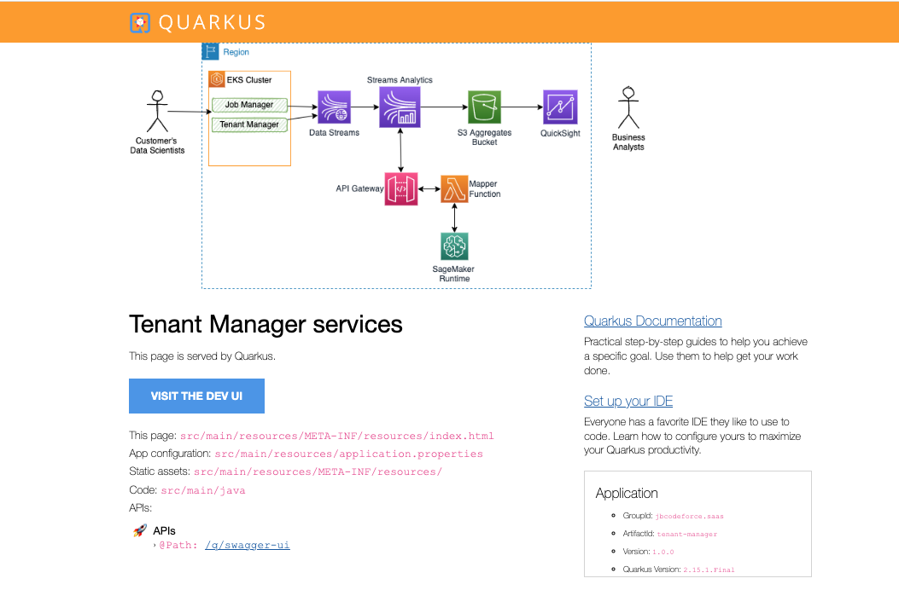
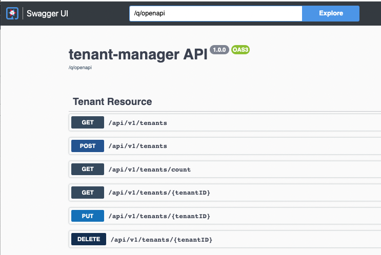
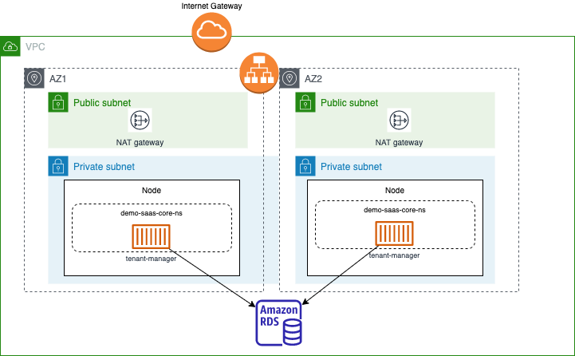

# Java Based microservices

This note address simple implementation and deployment detail of the two microservices used in the demonstration.

## Tenant Manager

This is a Java Quarkus app, with Reactive REST API, persistence to RDS Postgresql via JPA and Panache. We recommend to review the following Quarkus guides to get started on this stack.

* [GENERATING JAX-RS RESOURCES WITH PANACHE](https://quarkus.io/guides/rest-data-panache).
* [Reactive messaging](https://quarkus.io/guides/kafka-reactive-getting-started).
* [Kubernetes extension](https://quarkus.io/guides/deploying-to-kubernetes).

The service supports basic CRUD operation on the Tenant entity. Panache is doing the JPA mapping to JDBC. The OpenAPI extension is added to offer a swagger User interface so it easier to test the component. We use the Repository pattern for the Panache.

The home page of the application from which we can access to the Swagger UI



The Swagger UI with the defined OpenAPI



The Stream processing in Flink application will code the `GET /api/v1/tenants/{tenantID}` API to get the information about the company doing one of the big data batch processing. 

## Run locally

* Start docker compose for a local postgresql

```sh
docker compose up -d
```

* Start quarkus in dev mode: `quarkus dev` if you have the CLI, or `mvn dev` with maven.

* Verify the service works locally with command like:

```sh
# Get all tenants in the database
curl -X GET localhost:8080/api/v1/tenants
# Get one tenant
curl -X GET localhost:8080/api/v1/tenants/comp_2
```

## Build docker image and push it to ECR

* Create the ECR repository: named jbcodeforce/demo-saas-tenant-mgr

```sh
./scripts/createECRrepository.sh
# OR to a new name
./scripts/createECRrepository.sh anothername/demo-saas-tenant-mgr
```

The result may look like:

```json
{
    "repository": {
        "repositoryArn": "arn:aws:ecr:us-west-2:v..accountnumber:repository/jbcodeforce/demo-saas-tenant-mgr",
        "registryId": "4..accountnumber",
        "repositoryName": "jbcodeforce/demo-saas-tenant-mgr",
        "repositoryUri": "4..accountnumber.dkr.ecr.us-west-2.amazonaws.com/jbcodeforce/demo-saas-tenant-mgr",
        "createdAt": "2022-12-28T09:48:16-08:00",
        "imageTagMutability": "MUTABLE",
        "imageScanningConfiguration": {
            "scanOnPush": false
        },
        "encryptionConfiguration": {
            "encryptionType": "AES256"
        }
    }
}
```

* Be sure to be logged to the ECR registry with a command like:

```sh
aws ecr get-login-password --region us-west-2 | docker login --username AWS --password-stdin 4..accountnumber.dkr.ecr.us-west-2.amazonaws.com
```


* Build and push the image using the ECR base URL for your region and account:

```sh
./scripts/buildAll.sh 40..accountnumber.dkr.ecr.us-west-2.amazonaws.com

# verify
docker images | grep demo-saas-tenant-mgr
```

[The reference documentation for ECR push image](https://docs.aws.amazon.com/AmazonECR/latest/userguide/docker-push-ecr-image.html)

## Deploy the app to EKS

The following figure illustrates what we are deploying:



### RDS Postgresql database

As a pre-requisite we need one instance of RDS postgresql database. It should have been created with the solution CDK, in `setup/saas-solution-cdk`.

(See python doc)[https://docs.aws.amazon.com/cdk/api/v2/python/aws_cdk.aws_rds/README.html#starting-an-instance-database]

### Kubernetes extension for Quarkus

We recommend to read the [Kubernetes Quarkus guide](https://quarkus.io/guides/deploying-to-kubernetes). The Kubernetes extension was added to the `pom.xml` and a `kubernetes.yml` file is create at each build and include deployment, services, service account. To tune this generated file the following declarations were added to the `application.properties`:

```properties
quarkus.kubernetes.namespace=demo-saas-core
quarkus.container-image.registry=4....dkr.ecr.us-west-2.amazonaws.com/jbcodeforce/demo-saas-tenant-mgr
quarkus.container-image.tag=latest
quarkus.kubernetes.env.secrets=saas-secret
```