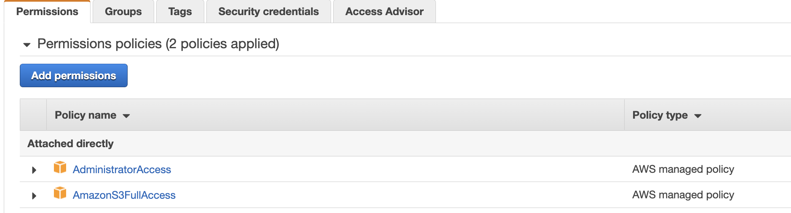

# Company Churn model development

The goal of this service is to compute a risk factor for a company to leave a SaaS offering. The scoring takes into account the industry type, the company size in term of revenue and number of employees, and then specifics features from the SaaS business model. In our case we will take a company doing big data job management so we can add 
 variables: number of jobs in last 30 days, and 90 days, monthly  charge, total charge, number of time tutorials were done so far cross all users.    

## Preparing the data

Under the [CompanyRisk folder](https://github.com/jbcodeforce/big-data-tenant-analytics/tree/main/CompanyRisk) there is a simple Python program to be used to generate random data of companies within industries with revenue and number of employees, # of jobs submitted the last 30 days, 90 days, current monthly fees and accumulated fees. 

### Run the simulator


1. Be sure to have last aws CLI and python library using the docker image. If not rebuild the image from [aws-studies labs folder](https://github.com/jbcodeforce/aws-studies/tree/main/labs)

    ```sh
    docker build -f https://raw.githubusercontent.com/jbcodeforce/aws-studies/main/labs/Dockerfile -t jbcodeforce/aws-python .
    ```

1. Start the python env with docker

    ```sh
    docker run --rm  --name pythonapp -v $(pwd):/app -v ~/.aws:/root/.aws -it  -p 5000:5000 jbcodeforce/aws-python bash
    ```

1. Run the data generator

    ```sh
    python CompanyDataGenerator.py companies.csv --nb_records 10000
    ```

    This should create `companies.csv` file with 10,000 rows

### Code explanations

* Use argparser to define the argument for the command line
* Generate nb_records row: company has unique id, industry is selected randomly, revenue and number of employee is linked to the revenue.
* Churn flag is set to 1 if revenue is low
* Use `csv` library to write the csv file


## Upload generated files to S3

### Pre-requisites

1. Be sure to have an IAM role with S3FullAccess

    

1. Get Access Key and Secret key and configuge aws, we specific profile: `aws configure --profile s3admin`

1. Verify you can access s3 using: `aws s3 ls`. Use the command:

    ```sh
    aws s3 cp $PWD/companies.csv s3://jb-data-set/churn/companies.csv  --profile s3admin
    ```

1. [Alternative] Start the Python 3 environment using docker

    ```sh
    docker run --rm  --name pythonapp -v $(pwd):/app -v ~/.aws:/root/.aws -it  -p 5000:5000 jbcodeforce/aws-python bash
    ```

    * Using the python code and boto3 library do the following:

    ```sh
    python copyToS3.py us-west-2 jb-data-set churn $PWD/companies.csv 
    ```

    * If some libraries are not installed do `pip install -r requirements.txt`

## With AWS SageMaker
