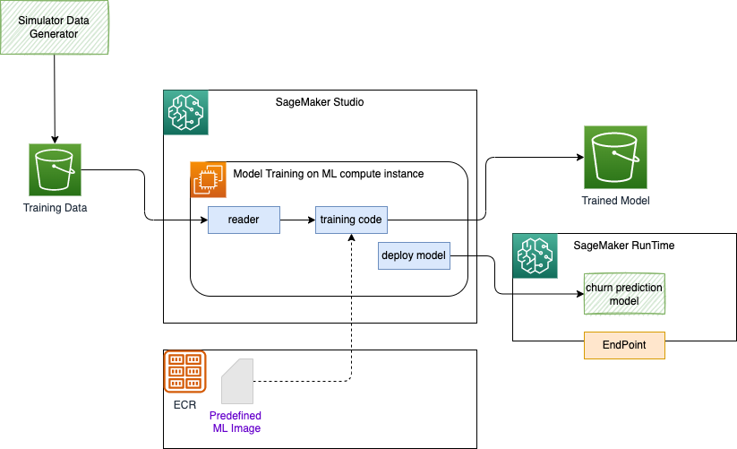

# Company Churn assess AI model development with SageMaker


The goal of this service is to compute the risk for a customer to leave the SaaS platgorm. The scoring takes into account the industry type, the company size in term of revenue and number of employees, and then specifics features from the SaaS business model. In our case we will take a company doing big data job management so we can add 
 variables: number of jobs in last 30 days, and 90 days, monthly  charge, total charge, number of time tutorials were done so far cross all users.    

Here is simple example of training data: (Revenue is in million $)

```csv
Company,Industry,Revenue,Employees,#job30,#job90,MonthlyCharge,TotalCharge,Churn
comp_0,travel,9270,4635,3,56,446,1476,1
comp_1,finance,99420,49710,7,97,424,3039,0
comp_2,gov,83410,27803,7,66,1128,1422,0
comp_3,service,59650,19883,5,58,967,3661,0
comp_4,retail,29080,14540,4,13,461,1172,1
comp_5,finance,83590,20898,5,75,472,3735,0
comp_6,retail,86080,28693,9,85,824,4475,1
```

The following figure illustrates how to build the model using Amazon SageMaker (in green the components developed in this solution) using training and test data sets and then deployed model in a scalable runtime:



**Figure 1: SageMaker Model Training and Runtime deployment** 

The runtime is exposing an Endpoint that we can access using ASW SDK from a lambda or a microservice. 

To train the model we use a predefined algorithm, packaged as docker image, and available inside SageMaker notebook, via access to Amazon Elastic Container Registry.

This repository includes a [Simulator (CompanyDataGenerator.py)](https://github.com/jbcodeforce/big-data-tenant-analytics/blob/main/CompanyRisk/CompanyDataGenerator.py) to generate data to build training set. The generated records can be uploaded to S3 via AWS CLI. It also includes a [SageMaker notebook (company-churn-sm.ipynb)](https://github.com/jbcodeforce/big-data-tenant-analytics/blob/main/CompanyRisk/company-churn-sm.ipynb) that can be executed in AWS SageMaker Studio to perform some simple feature engineering, train the model, and deploy the model to SageMaker runtime so it can be called from any clients which has the endpoint information.

## Preparing the data

Within this repository under the [CompanyRisk folder](https://github.com/jbcodeforce/big-data-tenant-analytics/tree/main/CompanyRisk) there is a simple Python program to be used to generate random data of companies within industry, with revenue, number of employees, # of jobs submitted the last 30 days, 90 days, current monthly fees and accumulated fees. 

The [companies.csv](https://github.com/jbcodeforce/big-data-tenant-analytics/blob/main/CompanyRisk/companies.csv) file was already created from a previous run and can be used as source for training.

### Run the simulator

If you want to re-run the simulator you can do the following steps.

1. Be sure to have last AWS CLI and python library. You can use [AWS Powershell]() and clone this repository, or if you use your own computer, you can use a docker image built from [aws-studies labs folder](https://github.com/jbcodeforce/aws-studies/tree/main/labs) dockerfile:

    ```sh
    docker build -f https://raw.githubusercontent.com/jbcodeforce/aws-studies/main/labs/Dockerfile -t jbcodeforce/aws-python .
    ```

1. Start the python env with docker

    ```sh
    docker run --rm  --name pythonapp -v $(pwd):/app -v ~/.aws:/root/.aws -it  -p 5000:5000 jbcodeforce/aws-python bash
    ```

1. Run the data generator

    ```sh
    python CompanyDataGenerator.py companies.csv --nb_records 10000
    ```

    This should create `companies.csv` file with 10,000 rows

### Simulator code explanations

* Use argparser to define the argument for the command line
* Generate nb_records row: company has unique id, industry is selected randomly, revenue and number of employee is linked to the revenue.
* Churn flag is set to 1 if revenue is low
* Use `csv` library to write the csv file

## Upload generated files to S3

### Pre-requisites

1. Be sure to have an IAM role with S3FullAccess. The name of the role is ()

    

1. Get Access Key and Secret key and configuge aws, we specific profile: `aws configure --profile s3admin`

1. Verify you can access s3 using: `aws s3 ls`. Use the command:

    ```sh
    aws s3 cp $PWD/companies.csv s3://jb-data-set/churn/companies.csv  --profile s3admin
    ```

1. [Alternate] Start the Python 3 environment using docker

    ```sh
    docker run --rm  --name pythonapp -v $(pwd):/app -v ~/.aws:/root/.aws -it  -p 5000:5000 jbcodeforce/aws-python bash
    ```

    * Using the python code and boto3 library do the following:

    ```sh
    python copyToS3.py us-west-2 jb-data-set churn $PWD/companies.csv 
    ```

    * If some libraries are not installed do `pip install -r requirements.txt`

## Build and deploy the model with AWS SageMaker

The goal of this section is to build the churn predictive scoring model within SageMaker. The steps are simple:

1. Create or use your SageMaker Studio, [here are  workshop instructions](https://catalog.us-east-1.prod.workshops.aws/workshops/63069e26-921c-4ce1-9cc7-dd882ff62575/en-US/prerequisites/option2) to do so.
1. Be sure to have an IAM role for SageMaker to access remote services like S3. 
1. In the folder manager create a new folder named `SaaS-company-churn` and then upload the `companies.csv` file and the SageMaker Notebook [company-churn-sm.ipynb](https://github.com/jbcodeforce/big-data-tenant-analytics/blob/main/CompanyRisk/company-churn-sm.ipynb)

    

1. Executes the steps one by one or all of them, it should create the training set, test sets, build and deploy the model using the SageMaker Python API. 

1. Be sure to keep the name of the service end point as it is needed for the client to call this service.

### Deeper dive: build model 

The work is quite simple, remove unnecessary columns, transform categorical features to one hot columns. Split 20% of the records to build a test set, the rest being the training set.

Using Python AWS SDK named boto3, we can upload the created data sets to S3 bucket 

```python
boto3.Session().resource('s3').Bucket(data_bucket).Object(os.path.join(PREFIX, 'train/train.csv')).upload_file('train.csv')
boto3.Session().resource('s3').Bucket(data_bucket).Object(os.path.join(PREFIX, 'validation/test.csv')).upload_file('test.csv')
```

and then use sagemaker SDK to 

```python
train_data = sagemaker.inputs.TrainingInput(
    s3_train_data,
    distribution="FullyReplicated",
    content_type="text/csv",
    s3_data_type="S3Prefix",
    record_wrapping=None,
    compression=None,
)
validation_data = sagemaker.inputs.TrainingInput(
    s3_validation_data,
    distribution="FullyReplicated",
    content_type="text/csv",
    s3_data_type="S3Prefix",
    record_wrapping=None,
    compression=None,
)
```

As illustrated in figure above, we are using pre-build algorithm in the form of SageMaker container image:

```python
from sagemaker.image_uris import retrieve

container = retrieve("linear-learner", boto3.Session().region_name, version="1")
print(container)
```

And then fit the model by using an [LinearLearner](https://sagemaker.readthedocs.io/en/stable/algorithms/tabular/linear_learner.html) estimator as a supervised learning algorithms used for solving classification or regression problems.

```python
from time import gmtime, strftime
job_name = "Linear-learner-company-churn-" + strftime("%H-%M-%S", gmtime())
print("Training job", job_name)

linear = sagemaker.estimator.Estimator(
    container,
    role,
    input_mode="File",
    instance_count=1,
    instance_type="ml.m4.xlarge",
    output_path=output_location,
    sagemaker_session=sess,
)

linear.set_hyperparameters(
    epochs=16,
    wd=0.01,
    loss="absolute_loss",
    predictor_type="regressor",
    normalize_data=True,
    optimizer="adam",
    mini_batch_size=1000,
    lr_scheduler_step=100,
    lr_scheduler_factor=0.99,
    lr_scheduler_minimum_lr=0.0001,
    learning_rate=0.1,
)
linear.fit(inputs={"train": train_data, "validation": validation_data}, job_name=job_name)
```

* Deploy the model with the command

```python
linear_predictor = linear.deploy(initial_instance_count=1, instance_type="ml.c4.xlarge")
print(f"\ncreated endpoint: {linear_predictor.endpoint_name}")
```

* We can try some prediction in the notebook

```python
payload="19100,9550,6,39,227,810,0,0,0,0,0,0,1,0,0"
result=linear_predictor.predict(payload)
print(result)
```

Or using a python client, you can run inside a EC2 or on your computerm see code [CompanyRisk/CallSageMakerRunTime.py](https://github.com/jbcodeforce/big-data-tenant-analytics/blob/main/CompanyRisk/CallSageMakerRunTime.py), be sure to set the ENDPOINT to the SageMaker endpoint name. 

The URL is not public, but could also being accessed via an HTTP POST from an EC2 in the same VPC.