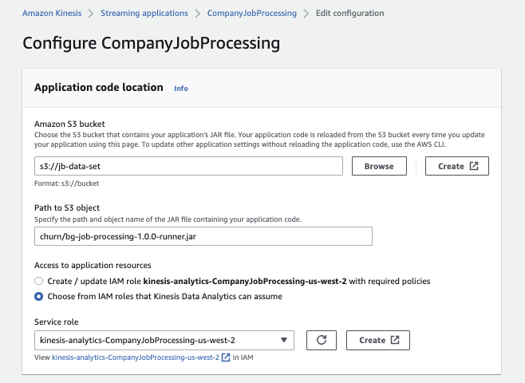

# Real-time analytics with Kinesis Data Analytics

The goal of this component is to compute stateful analytics, do data transformation, from the data coming in streams. The current implementation illustrates remote async calls to SageMaker (via API Gateway) and persistence to S3.


**Figure 1: Streaming components**

## Kinesis Data Streams

There is nothing special in this demonstration, the creation of the different data streams is done using CDK. 

* `bigdatajobs`: for job related events
* `companies`: for event related to tenant entities events
* `enrichedcompanies` to shared events with enriched data to be consumed by other services.


See [the python file kinesis-cdk/app.py](https://github.com/jbcodeforce/big-data-tenant-analytics/tree/main/setup/kinesis-cdk/app.py) for the CDK definitions of those streams and to deploy them, do a `cdk deploy` under the folder: [setup/kinesis-cdk](https://github.com/jbcodeforce/big-data-tenant-analytics/tree/main/setup/kinesis-cdk).
The persistence is set to 24 hours.

## Kinesis Data Analytics Code explanation

The code is under [rt-analytics/bg-job-processing](https://github.com/jbcodeforce/big-data-tenant-analytics/tree/main/rt-analytics/bg-job-processing) folder.
 
The main input stream includes the job events, and are published to Kinesis Data Streams names `bigdatajobs`. Once received we need to enrich with the company data, which lead to an asynchronous call to TenantManager service.
The Company response includes: company_id, industry, revenu, employees, job30, job90, monthlyFee, totalFee in a form of JSON document.

Once Company data is collected, the call to the ML scoring model is also done asynchronously, the churn flag may be update.

The final step is to write to S3 bucket.

### Parameters

The following parameters need to be specified

 | Parameter | Description |Default | 
 | --- | --- | --- |
 | aws.region | Region where all the services run | us-west-2 |
 | jobs.stream.initial.position | Position in the streams to start consuming from | LATEST |
 | jobs.stream.name | Job events stream name | bigdatajobs |
 | S3SinkPath | Bucket to write enriched company events| | 
 | predictChurnApiEndpoint | URL of the API in API gateway | |
 | predictChurnApiKey | | None for API Gateway |


Those parameters are defined in the Application Creation request. [See create-request.json file](https://github.com/jbcodeforce/big-data-tenant-analytics/blob/main/rt-analytics/create_request-tmpl.json)

???- "EnvironmentProperties in request.json"
    ```json
    "EnvironmentProperties": {
            "PropertyGroups": [
                {
                    "PropertyGroupId": "ProducerConfigProperties",
                    "PropertyMap": {
                        "flink.stream.initpos": "LATEST",
                        "aws.region": "us-west-2",
                        "AggregationEnabled": "false"
                    }
                },
                {
                    "PropertyGroupId": "ApplicationConfigProperties",
                    "PropertyMap": {
                        "predictChurnApiEndpoint": "https://API.execute-api.us-west-2.amazonaws.com/prod/assessChurn",
                        "predictChurnApiKey" : " ",
                        "S3SinkPath": "s3://jb-data-set/churn"
                    }
                },
                {
                    "PropertyGroupId": "ConsumerConfigProperties",
                    "PropertyMap": {
                        "aws.region": "us-west-2",
                        "jobs.stream.initial.position": "LATEST",
                        "jobs.stream.name": "bigdatajobs",
                        "companies.stream.initial.position": "LATEST",
                        "companies.stream.name": "companies"
                    }
                }
            ]
        },
        ```

### Code approach

The Flink data source is a KinesisConsumer and the declaration looks mostly always the same:

```java
import org.apache.flink.streaming.connectors.kinesis.FlinkKinesisConsumer;

// in the main()

final StreamExecutionEnvironment env = StreamExecutionEnvironment.getExecutionEnvironment();

env.addSource(new FlinkKinesisConsumer<>(inputStreamName,
                new SimpleStringSchema(),
                inputProperties));
```


## Deploy


1. Create IAM role to support application execution

    We need to create a role and permission policy so the application can access source and sink resources and assume the role for `kinesisanalytics.amazonaws.com` service:

    ```sh
    aws iam create-role --role-name CompanyAnalyticsRole --assume-role-policy-document file://trust-relationship.json
    ```

1. We need to define permissions policy with two statements: one that grants permissions for the read action on the source streams, and another that grants permissions for write actions on the sink stream which will be S3 bucker and Data Streams:

    ???- "IAM policy"
        ```json
        {
            "Version": "2012-10-17",
            "Statement": [
                {
                    "Sid": "ReadCodeFromS3",
                    "Effect": "Allow",
                    "Action": [
                        "s3:GetObject",
                        "s3:GetObjectVersion"
                    ],
                    "Resource": ["arn:aws:s3:::jb-data-set/churn/bg-job-processing-1.0.0.jar"]
                },
                {
                    "Sid": "CompanySinkS3",
                    "Effect": "Allow",
                    "Action": [
                        "s3:PutObject",
                        "logs:DescribeLogStreams"
                    ],
                    "Resource": [
                        "arn:aws:s3:::jb-data-set/churn/*",
                        "arn:aws:logs:us-west-2:ACCOUNT_NUMBER:log-group:/aws/kinesis-analytics/CompanyJobProcessing:log-stream:*"
                    ]
                },
                {
                    "Sid": "DescribeLogGroups",
                    "Effect": "Allow",
                    "Action": [
                        "logs:DescribeLogGroups"
                    ],
                    "Resource": [
                        "arn:aws:logs:us-west-2:ACCOUNT_NUMBER:log-group:*"
                    ]
                },
                {
                    "Sid": "DescribeLogStreams",
                    "Effect": "Allow",
                    "Action": [
                        "logs:DescribeLogStreams"
                    ],
                    "Resource": [
                        "arn:aws:logs:us-west-2:ACCOUNT_NUMBER:log-group:/aws/kinesis-analytics/CompanyJobProcessing:log-stream:*"
                    ]
                },
                {
                    "Sid": "PutCloudwatchLogs",
                    "Effect": "Allow",
                    "Action": [
                        "logs:PutLogEvents"
                    ],
                    "Resource": [
                        "arn:aws:logs:us-west-2:ACCOUNT_NUMBER:log-group:/aws/kinesis-analytics/CompanyJobProcessing:log-stream:kinesis-analytics-log-stream"
                    ]
                },
                {
                    "Sid": "ReadInputStream",
                    "Effect": "Allow",
                    "Action": "kinesis:*",
                    "Resource": ["arn:aws:kinesis:us-west-2:ACCOUNT_NUMBER:stream/companies",
                        "arn:aws:kinesis:us-west-2:ACCOUNT_NUMBER:stream/bigdatajobs"
                    ]
                },
                {
                    "Sid": "WriteOutputStream",
                    "Effect": "Allow",
                    "Action": "kinesis:*",
                    "Resource": "arn:aws:kinesis:us-west-2:ACCOUNT_NUMBER:stream/enrichedcompanies"
                }
            ]
        }
        ```

1. Attach the policy to an IAM role 

    ```sh
    aws iam put-role-policy --role-name CompanyAnalyticsRole --policy-name KinesisPolicy --policy-document file://security-policy.json
    ```

1. Build the java packaging and upload it to S3

    ```sh
    # build the uber jar
    mvn package
    # upload to S3
    aws s3 cp $(pwd)/target/bg-job-processing-1.0.0.jar s3://jb-data-set/churn/bg-job-processing-1.0.0.jar
    ```

1. Create the Data Analytics application

    ```sh
     aws kinesisanalyticsv2 create-application --cli-input-json file://create_request.json
     ```

1. Start the Kinesis Analytics apps

    ```sh
    aws kinesisanalyticsv2 start-application --cli-input-json file://start_application.json
    ```

1. Send some data: use Start Python Env docker container:

    ```sh

    # 
    python src/main/python/SendJobEventToKinesis.py 
    ```

1. To update code, we need to delete previous code, upload new version to S3, and update application:

    ```sh
    aws s3 rm s3://jb-data-set/churn/bg-job-processing-1.0.0.jar
    aws s3 cp $(pwd)/target/bg-job-processing-1.0.0.jar s3://jb-data-set/churn/bg-job-processing-1.0.0.jar
    # Get application ID
    aws kinesisanalyticsv2 describe-application --application-name CompanyJobProcessing
    # Modify the updateApplication.json file with the application ID
    {
    "ApplicationDetail": {
        "ApplicationARN": "arn:aws:kinesisanalytics:us-west-2:403993201276:application/CompanyJobProcessing",
        "ApplicationDescription": "Java Flink app to merge company and big data job events",
        "ApplicationName": "CompanyJobProcessing",
        "RuntimeEnvironment": "FLINK-1_15",
        "ServiceExecutionRole": "arn:aws:iam::403993201276:role/CompanyAnalyticsRole",
        "ApplicationStatus": "RUNNING",
        "ApplicationVersionId": 3,
    }
    
    aws kinesisanalyticsv2 update-application --application-name CompanyJobProcessing --cli-input-json file://updateApplication.json
    ```

### Manual deployment with the Console

Using the Kinesis console we can add an Analytics Application:

1. Select the Flink runtime version:

    

1. Select the IAM role or create a new one. 

    
 
1. For demonstration we can use the Development deployment with 1 

    

1. Add configuration detail to get packaged code: ``

    

1. Specifying the logging level

    

1. Once deployed, start the job with the `Run without snapshot` option:

    


## Clean up

```sh
aws kinesisanalyticsv2 stop-application --application-name CompanyJobProcessing --force 
aws kinesisanalyticsv2 describe-application --application-name CompanyJobProcessing | jq 
aws kinesisanalyticsv2 delete-application --application-name CompanyJobProcessing --create-timestamp 2022-12-23T17:02:09-08:00
```

```sh
aws s3 rm s3://jb-data-set/churn/bg-job-processing-1.0.0.jar

```


## to rework

Joins between company and job streams on the company ID and add the number of jobs run (from job event) to the company current jobs count.

* Job is: company_id, userid , #job_submitted
* Out come is : company_id, industry, revenu, employees, job30 + #job_submitted, job90 + #job_submitted, monthlyFee, totalFee